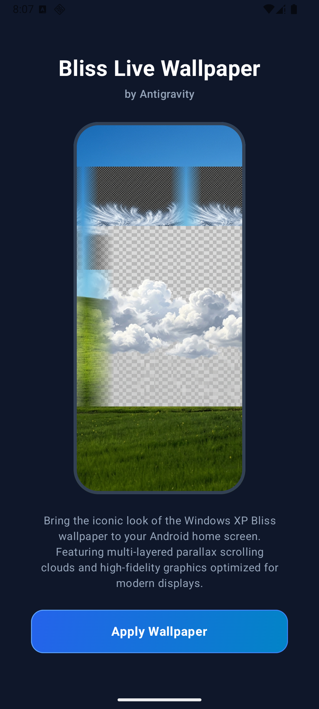
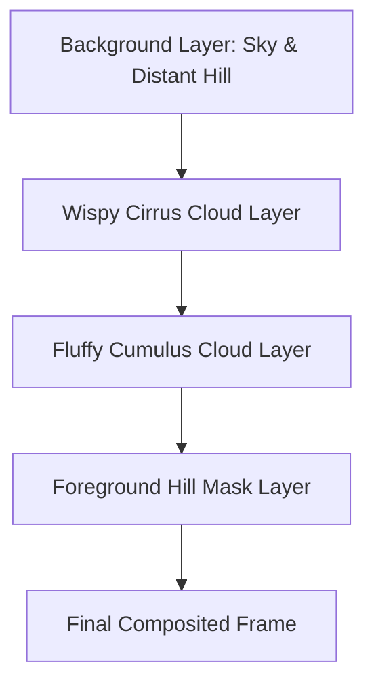

# Bliss Revisited - Dynamic Parallax Live Wallpaper

A premium Android live wallpaper service that reimagines the classic Windows XP "Bliss" wallpaper with fluid, multi-layered parallax scrolling, interactive home screen swipe reactions, and high-fidelity volumetric cloud layers.



## Core Architecture & Layering

The live wallpaper operates as a high-performance "sandwich" layout using the Android `WallpaperService` and `Canvas` drawing API. By drawing elements in a specific order, we create a flawless depth perspective where clouds appear to float behind the green hill but in front of the sky.



### Rendering Order:
1. **Background Layer (`bliss_hill_bg`)**: Represents the base sky gradient and a distant green hill. Drawn directly on the canvas, reacting 100% to horizontal home screen swipe offsets.
2. **Wispy Cloud Layer (`bliss_clouds_wispy`)**: High-altitude wispy cirrus clouds and vapor trails. Placed high in the sky (`yPositionFactor = 0.02f` or 2% of screen height) and shifts horizontally at **15%** of the hill's scroll speed.
3. **Fluffy Cloud Layer (`bliss_clouds`)**: Low-altitude fluffy cumulus clouds. Placed lower in the sky (`yPositionFactor = 0.28f` or 28% of screen height) and shifts horizontally at **35%** of the hill's scroll speed.
4. **Foreground Hill Mask (`bliss_hill_foreground`)**: A precise transparent PNG containing only the foreground green hill (sky region is cut out). Drawn on top of the scrolling clouds, acting as a natural depth mask.

---

## Technical Specifications & Parallax Mathematics

### 1. Parallax Depth Displacement
When swiping between home screen launcher panels, Android invokes `onOffsetsChanged(...)`. The displacement of the base background is calculated by cropping:
$$\text{maxBgShift} = \text{max}(0, \text{scaledBackgroundWidth} - \text{screenWidth})$$
$$\text{hillShiftX} = -\text{maxBgShift} \times \text{xOffset}$$

To create a natural depth illusion (further objects scroll slower), we scale the scroll displacement of the clouds relative to the hills using a depth ratio:
$$\text{swipeShiftX}_{\text{clouds}} = \text{hillShiftX} \times \text{parallaxFactor}$$
* **Wispy Clouds**: `parallaxFactor = 0.15f`
* **Fluffy Clouds**: `parallaxFactor = 0.35f`

### 2. Seamless Infinite Looping & Edge Fading
To prevent visible seam lines or sudden popping jumps when clouds scroll off-screen, we apply a mathematical tiling and initialization fade:

During bitmap load, we run a custom `fadeEdges(Bitmap, fadePercent)` function which uses a linear gradient alpha mask in `PorterDuff.Mode.DST_IN` to smoothly fade out the leftmost and rightmost **15%** (`CLOUD_FADE_PERCENT = 0.15f`) of the cloud textures.

The tiling period is calculated as:
$$\text{Period} = \text{scaledWidth} - \text{overlapWidth}$$
$$\text{overlapWidth} = \text{scaledWidth} \times \text{CLOUD_FADE_PERCENT}$$

Horizontal offsets wrap dynamically within the rendering loop:
```kotlin
var drawX = swipeShiftX + scrollOffset
while (drawX > 0) drawX -= period
while (drawX < -period) drawX += period
```
We then tile the cloud bitmap horizontally from `drawX` across the screen:
```kotlin
var tileX = drawX
while (tileX < screenWidth) {
    canvas.drawBitmap(bitmap, null, RectF(tileX, startY, tileX + scaledWidth, startY + scaledHeight), paint)
    tileX += period
}
```

---

## App Launcher Icon

The launcher icon is designed as an Android Adaptive Icon (`res/mipmap-anydpi-v26/ic_launcher.xml`) with modern, high-fidelity vector styling:

* **Background (`res/drawable/ic_launcher_background.xml`)**: A linear gradient transitioning from deep Windows XP royal blue (`#1A3FB2`) at the top, to vibrant blue (`#2563EB`), sky blue (`#3B82F6`), and light horizon blue (`#60A5FA`).
* **Foreground (`res/drawable/ic_launcher_foreground.xml`)**: 
  - Layered vector hills: A deep forest green back hill (`#15803D` to `#14532D` gradient) and a vibrant grass green front hill (`#22C55E` to `#15803D` gradient).
  - Sunlit Highlight Path: A semi-transparent light green highlight (`#86EFAC` at 35% opacity) mapped precisely along the crest of the main hill to represent sunlight.
  - Floating Clouds: Curved volumetric vector clouds with multi-stop linear gradients (`#FFFFFF` to `#DCE6F5`) and offset semi-transparent paths representing soft drop shadows.
  - Oversized Viewport: Path coordinates extend beyond the standard `108dp` (ranging from `-10` to `118` on the X-axis) to avoid empty gaps during the system launcher's parallax scale-and-translate animations.

---

## Build & Deployment Commands

### Prerequisites
* JDK 17
* Android SDK (Command-line Tools or Android Studio)
* Environment variable `ANDROID_HOME` pointing to your Android SDK location

### Compile Debug APK
To compile the application inside WSL/Linux or your terminal:
```bash
export ANDROID_HOME=/home/iggdawg/Android/Sdk  # Adjust to your SDK path
./gradlew assembleDebug
```
The compiled APK will be generated at:
`app/build/outputs/apk/debug/app-debug.apk`

### Install on Emulator or Device
Connect your device or start an emulator, then execute:
```bash
adb install -r app/build/outputs/apk/debug/app-debug.apk
```

---

## Project Structure

```text
├── app/
│   ├── src/main/
│   │   ├── java/com/example/blisswallpaper/
│   │   │   ├── BlissWallpaperService.kt   # Live Wallpaper Engine
│   │   │   ├── ui/main/
│   │   │   │   └── MainScreen.kt           # Onboarding & Preview UI (Compose)
│   │   ├── res/
│   │   │   ├── drawable-nodpi/             # High-res stitched raster bitmaps
│   │   │   │   ├── bliss_hill_bg.png
│   │   │   │   ├── bliss_hill_foreground.png
│   │   │   │   ├── bliss_clouds.png
│   │   │   │   └── bliss_clouds_wispy.png
│   │   │   ├── drawable/                   # Vector assets & app launcher components
│   │   │   │   ├── ic_launcher_background.xml
│   │   │   │   └── ic_launcher_foreground.xml
│   │   │   └── mipmap-anydpi-v26/          # Adaptive Launcher configuration
│   │   │       ├── ic_launcher.xml
│   │   │       └── ic_launcher_round.xml
```